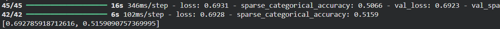
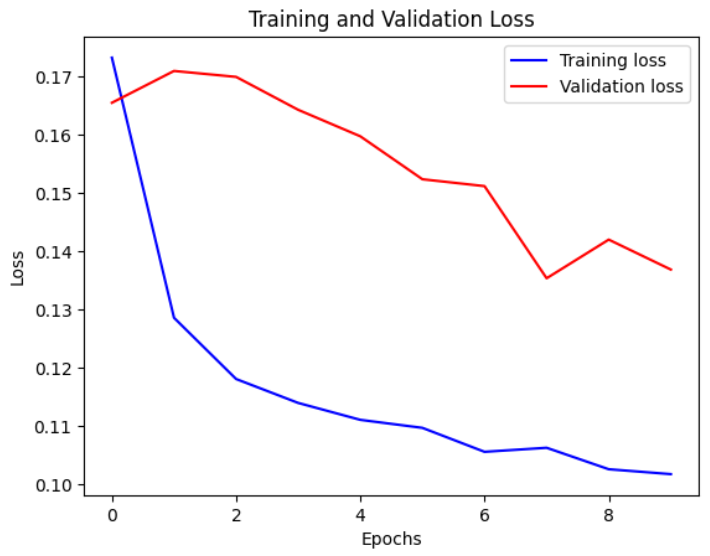
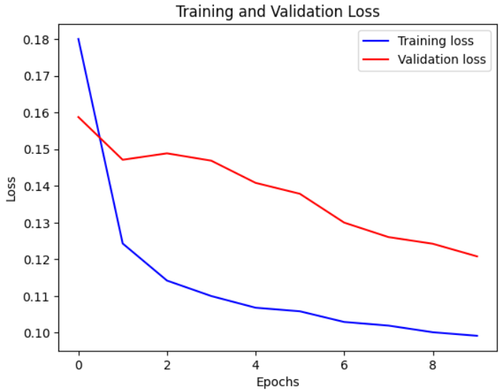

# CMPE 401 – Time Series Modeling Benchmark

## Overview
This project benchmarks two official Keras time-series examples:
- Transformer model for FordA classification
- LSTM model for Jena Climate forecasting

The objective was to reproduce both baselines, test controlled improvements, and compare performance using a structured benchmark summary.

## Repository Contents
- `transformer_classification.ipynb` — Transformer baseline code and results
- `lstm_forecasting.ipynb` — LSTM baseline and four experiments
- `images/` — Prediction plots and training loss curves
- `README.md` — Benchmark summary and project overview

## Model Summary

### Transformer
- Dataset: FordA
- Task: Binary classification
- Input: sequence of shape `(500, 1)`
- Output: 2 classes
- Result: baseline reproduction unsuccessful in current runtime
- Test accuracy: ~51.6%
- Loss: ~0.693

### LSTM
- Dataset: Jena Climate
- Task: Forecast future temperature
- Input: 7 weather features over time
- Output: single future temperature value
- Baseline metric: Best validation MSE = 0.1352

## LSTM Benchmark Results

| Version | Configuration | Best Val MSE | Observation |
|---|---|---:|---|
| Baseline | LSTM(32), past=720 | 0.1352 | Baseline performance |
| Exp 1 | LSTM(64), past=720 | 0.1285 | Improved |
| Exp 2 | LSTM(64→32), past=720 | 0.1353 | No improvement |
| Exp 3 | LSTM(32), past=1440 | 0.1208 | Best performance |
| Exp 4 | LSTM(64→32), past=1440 | 0.1258 | Good, but not best |

## Key Findings
- Increasing hidden size alone improved performance slightly.
- Stacking LSTM layers did not improve results.
- Increasing input history from 720 to 1440 gave the strongest improvement.
- Longer temporal context mattered more than added model complexity.

## Required Questions

### Which model was easier to understand and why?
The LSTM model was easier to understand because it directly uses past sequences to predict a future value. The Transformer was more abstract because of its attention-based structure.

### What improvement did you try, and what did you learn?
I tested changes to hidden size, model depth, and input history. The most important result was that increasing temporal context improved performance more than increasing model complexity.

## Example Results

### Transformer result

### LSTM baseline loss

### LSTM best model prediction

## Conclusion
The Transformer baseline could not be reproduced successfully in this environment. The LSTM experiments produced meaningful results, and the best-performing setup was a simple LSTM(32) model with a longer past window of 1440. This suggests that longer temporal context was more valuable than increased model complexity for this forecasting task.
